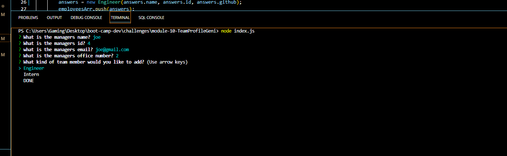

challenge description

Build a Node.js command-line application that takes the information about employees on a software engineering team and creates an HTML webpage that displays a summary for each person.

Instructions
open integraded terminal and run "node index.js" this bring the command line inquiries, use arrow keys to select options when given the chance.

Once you are finished setting up your team you can open the path in the html to view your team summarized.

